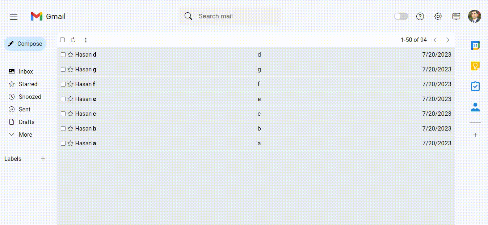

# Gmail Clone 

## What i practice

- Used HTML SCSS JS for Design
- Send and delete email
- Starred emails in starred section
- Saves in Local Storage
- Switch to dark-mode
- Full Responsive

## `URL`

https://gmail-clonnee.netlify.app/

## `Screen`

